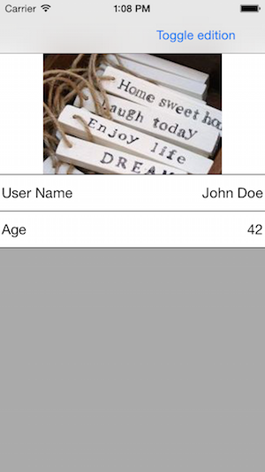

# TLFormView

[](https://travis-ci.org/BrunoBerisso/TLFormView)
[](http://cocoadocs.org/docsets/TLFormView)
[](http://cocoadocs.org/docsets/TLFormView)
[](http://cocoadocs.org/docsets/TLFormView)

TLFormView is _yet another_ form view that it's *trully* universal. This means that the same component support both iPhone and iPad using a mechanism around the [Auto Layout Visual Format] to adjust the layout to the runing device.

Because it doesn't extend ``UITableView`` you are completly free to create anything to use as a form field as long as it extends the base ``TLFormField`` class. It also has some nice fetures like: conditional visibility using ``NSPredicate``, in-place help for each field with ``UIPopoverControler`` and on-the-fly edit/read-only modes switch among other things.

## Usage

#### Form Setup

There is two baisc components: ``TLFormView`` and ``TLFormField``. ``TLFormView`` inherit from UIScrollView and add a data source and a delegate to create and handle events form the form. You need to impement three methods of the ``TLFormViewDataSource`` protocol to get a form setup, these are:

```objective-c
- (NSArray *)fieldNamesToShowInFormView:(TLFormView *)form;

- (TLFormField *)formView:(TLFormView *)form fieldForName:(NSString *)fieldName;

- (NSArray *)constraintsFormatForFieldsInForm:(TLFormView *)form;
```

``fieldNamesToShowInFormView:`` return an array of strings containing the "field names" or ids used to identify the fields in the form. ``formView:fieldForName:`` creates a field for every field name in the form. A field is any subclass of ``TLFormField`` (that is a sub class of ``UIView``), there is a set of default fields that can be used to fit the 80% of the use case. These are:

- TLFormFieldImage: for display images form an url or a raw image
- TLFormFieldList: for display a list of things
- TLFormFieldMultiLine: to show long text
- TLFormFieldSingleLine: to show short text, numbers and bool values
- TLFormFieldTitle: to show a short text formated as a title

The project has a category over ``TLFormField`` with basic methods for customizing the aspect of the filds. It has some methods to configure the title and give access to the ``UIAppearance`` proxy of the internal components.

Once you give a ``TLFormField`` for each field name to the form you need to tell it how to layout those fields. To do it you need to implement the third method of the data source ``constraintsFormatForFieldsInForm:`` and return an array of strings containing the the rules to place the fields in the screen. When writing the rules you need to reference the fields using the field names you return in the ``fieldNamesToShowInFormView:`` implementation. Here you have the chance to check for the capabilities of the device and adapt your layout changing the rules as you need.

Here is an example implementation of the three requiered methods in ``TLFormViewDataSource``:

```objective-c
- (NSArray *)fieldNamesToShowInFormView:(TLFormView *)form {
    return @[
        @"user_name",
        @"avatar",
        @"age",
    ];
}

- (TLFormField *)formView:(TLFormView *)form fieldForName:(NSString *)fieldName {
    
    Class fieldClass;
    NSString *title;
    id value;

    if ([fieldName isEqualToString:@"user_name"]) {
        fieldClass = [TLFormFieldSingleLine class];
        title = @"User Name";
        value = userModel.name;
    }
    else if ([fieldName isEqualToString:@"avatar"]) {
        fieldClass = [TLFormFieldImage class];
        title = @"Avatar";
        value = userModel.avatarUrl;
    }
    else {  //age
        fieldClass = [TLFormFieldSingleLine class];
        title = @"Age";
        value = userModel.age;
    }

    return [fieldClass formFieldWithName:fieldName title:title andDefaultValue:value];
}

- (NSArray *)constraintsFormatForFieldsInForm:(TLFormView *)form {
    
    //For iPhone we want a vertical layout like we get on a UITableView

    if (isIPhone) {
        return @[
            //Place the avatar on the top
            @"V:|-[avatar(==230)]-",
            @"H:|-[avatar(==420)]-|",
        
            //Now place all the fields to the bottom
            @"V:[avatar]-[user_name(>=44)]-",
            @"H:|-[user_name]-|",
        
            @"V:[age(==user_name)]-|",
            @"H:|-[age]-|"
        ];

    //For anyting else we will place the image on the top left and the rest of the fields to the right
    } else {
        return @[

            //Place the avatar on the top left
            @"V:|-[avatar(==230)]",
            @"H:|-[avatar]",
        
            //Now place all the fields to the right
            @"V:|-[user_name(>=44)]",
            @"H:|-[avatar]-[user_name]-|",
        
            @"V:[user_name]-[age(==user_name)]-|",
            @"H:|-[avatar(==420)]-[age]-|"
        ];
    }
}
```

This example produce this on iPhone



and this on iPad


##### TLFormModel

To help you with the setup of the form there is a class ``TLFormModel`` that do what we just did automatically inferring the implementation of the ``TLFormViewDataSource`` form his own taxonomy. The only thing that you need to do is extend it and add one property for each field do you want. The types of the properties should be one of types declared in the file TLFormModel.h. To read the values from the form you only need to access the properties like you wold do on any object, to write the values you will need to perform one extra call to the method ``reloadValues`` in the form to update it once the values are chenged (this is a cheep update, no view destruction is involved). This class implements ``TLFormViewDelegate`` to get his values on synch with the UI.

These are the declarations for the types supportd by ``TLFormModel``:

```objective-c
//Rendered as a separator in the form, allow to group fields in sections. Has no value or title
@interface TLFormSeparator : NSObject @end

//A short text
@interface TLFormText : NSString @end

//A long text
@interface TLFormLongText : NSString @end

//A shor text formated as a title
@interface TLFormTitle : NSString @end

//A number value
@interface  TLFormNumber : NSNumber @end

//A boolean value
@interface  TLFormBoolean : NSNumber @end

//A value in some enumeration, presented like a short text on read-only and a UISegmentedControl on edit mode (only strings are supported at this time)
@interface TLFormEnumerated : NSDictionary @end

//A list of values
@interface TLFormList : NSArray @end

//A image in the form of UIImage or NSURL
@interface TLFormImage : NSObject @end
```

These classes doesn't have any logic other than the one hinerited form his superclasses, they act almost as an annotation over a property. The intended way to construc values of this types is whith plain C functions declared in the TLFormModel.h that check the type of the parameter and copy the value given as parameter.

So using the type and value of his properties ``TLFormModel`` infere what kind of class should use for each property. For the form model to infere the title of the fields the properties should have names in snake case so for example, the property "user_name" will have the title "User Name". The sort of the fields is the one used to decleare the properties. For ex:

```objective-c
@property (nonatomic, strong) TLFormImage *avatar;
@property (nonatomic, strong) TLFormText *user_name;
```

Will present the avatar at the top and the user name below. If instead wold be declared like this:

```objective-c
@property (nonatomic, strong) TLFormText *user_name;
@property (nonatomic, strong) TLFormImage *avatar;
```

User name will appear first and then the avatar.

Our previous example could be writed with ``TLFormModel`` like this if we choose to use the same layout for iPhone and iPad:

```objective-c
@interface UserModel : TLFormModel

@property (nonatomic, strong) TLFormImage *avatar;
@property (nonatomic, strong) TLFormText *user_name;
@property (nonatomic, strong) TLFormNumber *age;

@end

@implementation UserModel @end
```

That's it. This will produce a vertical layout like the one we get on iPhone on all the platforms. Now to conect the ``TLFormModel`` to the form we need to set it as delegate and datasource of the form to use ``TLFoemModel``:

```objective-c
...

//At some point in some place...
FormUserModel *formUserModel = [FormUserModel new];

//This copy the values of our user model to the form model constructing the correct types using plain C functions
formUserModel.avatar = TLFormImage(userModel.avatar);
formUserModel.user_name = TLFormText(userModel.userName);
formUserModel.age = TLFormNumber(userModel.age);


TLFormView *form = ...

form.formDataSource = formUserModel;
form.formDelegate = formUserModel;
```

To add our not-iPhone layout we need to override the implementation of ``constraintsFormatForFieldsInForm:`` provided by ``TLFormModel`` like this:

```objective-c
@implementation UserModel

- (NSArray *)constraintsFormatForFieldsInForm:(TLFormView *)form {
    
    //For iPhone we want the default implementation provided so just return the 'super' version
    if (isIPhone)
        return [super constraintsFormatForFieldsInForm:form];

    //For anyting else use our cusomt layout
    else {
        return @[

            //Place the avatar on the top left
            @"V:|-[avatar(==230)]",
            @"H:|-[avatar]",
        
            //Now place all the fields to the right
            @"V:|-[user_name(>=44)]",
            @"H:|-[avatar]-[user_name]-|",
        
            @"V:[user_name]-[age(==user_name)]-|",
            @"H:|-[avatar(==420)]-[age]-|"
        ];
    }
}

@end
```

Now supose that we want to edit this user info and get the result back, this is how we could do it:

```objective-c

- (IBAction)toggleEditionAction:(id)sender {
    //Set the form on edit mode
    self.form.editing = !self.form.editing;
    //update the fileds to reflect it
    [self.form setupFields];
}

- (IBAction)saveUserAction:(id)sender {
    //Read the values ingresed by the user and save it to disc.

    [@{@"avatr": formUserModel.avatar,
       @"user_name": formUserModel.name,
       @"age": formUserModel.age}
    writeToURL:[self saveUrl] atomically:YES];
}

```

About "editing" the images. The default ``TLFormFieldImage`` don't provide any way to pick an image at this point. You will need to handle the field selection and show some kind of image picker.

#### Event handling

``TLFormView`` report two events throught ``TLFormViewDelegate`` out of the box: ``didSelectField:`` and ``didChangeValueForField:``. The events are fired by a ``TLFormField`` implementation that notify a form about it and the form then propagate the event out. Depending on how the field is implemented it maiht have more events to report. For example the ``TLFormFieldList`` use a ``UITableView`` to present the list of values so it has it's own delegate that allows to customize if the rows can be rearanged, or the selection of one row.

## Requirements

iOS >= 8.0

## Installation

TLFormView is available through [CocoaPods](http://cocoapods.org). To install
it, simply add the following line to your Podfile:

    pod "TLFormView"

Or clone the repo and check the code under `Pod/Classes`.

## Todo

There are many things that need improvement, here are some:

- [ ] Better docs
- [ ] TLFormDate support
- [ ] Better look and feel for the default fields
- [ ] Centralized style using the methods on ``TLFormField+UIAppearance.h``
- [ ] Expose the ‘defaultMetrics’ as part of the style
- [ ] TLFormModel: look a better way to make objects mutations more efficient
- [ ] Event handling improvement so it can be better used with ``TLFormModel``
- [ ] Add keyboard next/prev buttons
- [ ] Add selection support for list types
- [ ] Add image picker support (take a photo / choose from album)
- [ ] Validate with predicate
- [ ] Addaptative enum values: when the options are more than some ’n’ use a UIPicker instead of a UISegmented
- [ ] Add support for enum of any type (right now only strings are supported)
- [ ] Refactor the TLFormView to TLFormViewController so we can automatically handle: choose fotos, add a string to a list, layout for orientation, etc (?)

If you want to contribut to the project please consider pick one of this items.

## Author

BrunoBerisso, bruno@tryolabs.com

## License

TLFormView is available under the MIT license. See the LICENSE file for more info.

[Auto Layout Visual Format]: https://developer.apple.com/library/ios/documentation/UserExperience/Conceptual/AutolayoutPG/VisualFormatLanguage/VisualFormatLanguage.html#//apple_ref/doc/uid/TP40010853-CH3-SW11